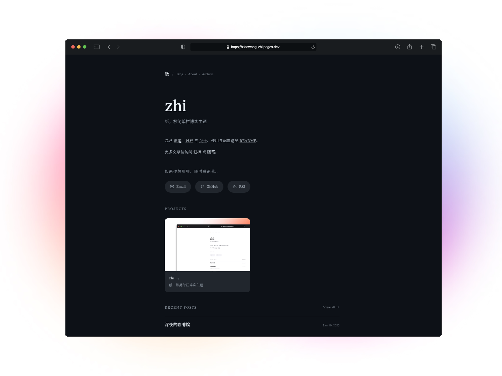
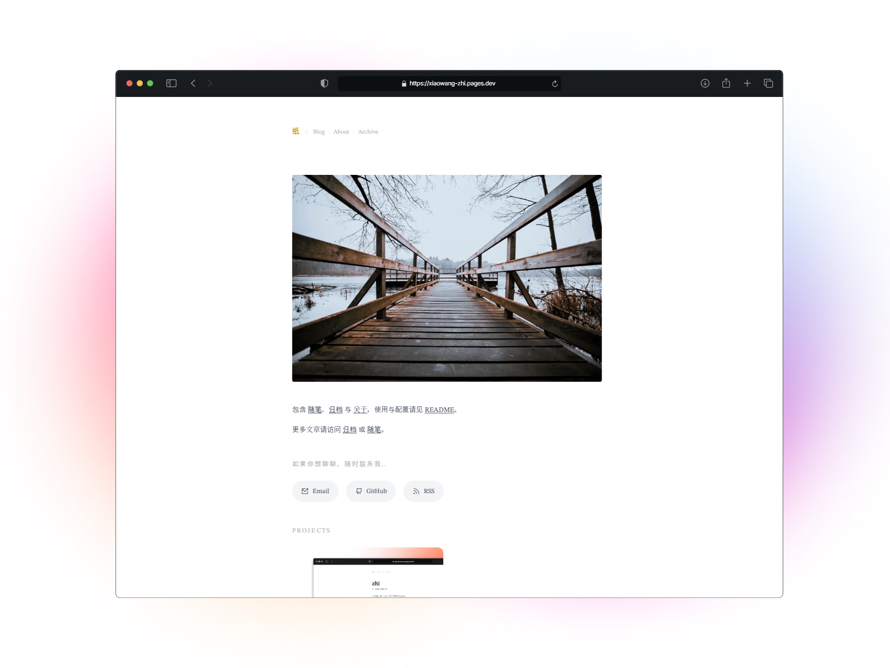
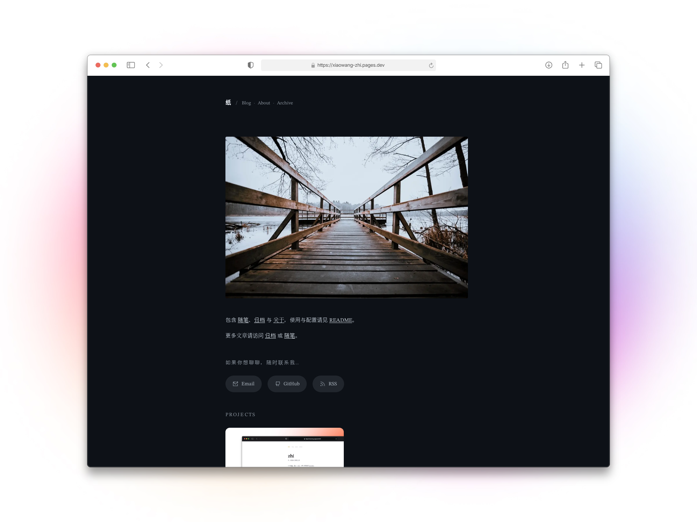
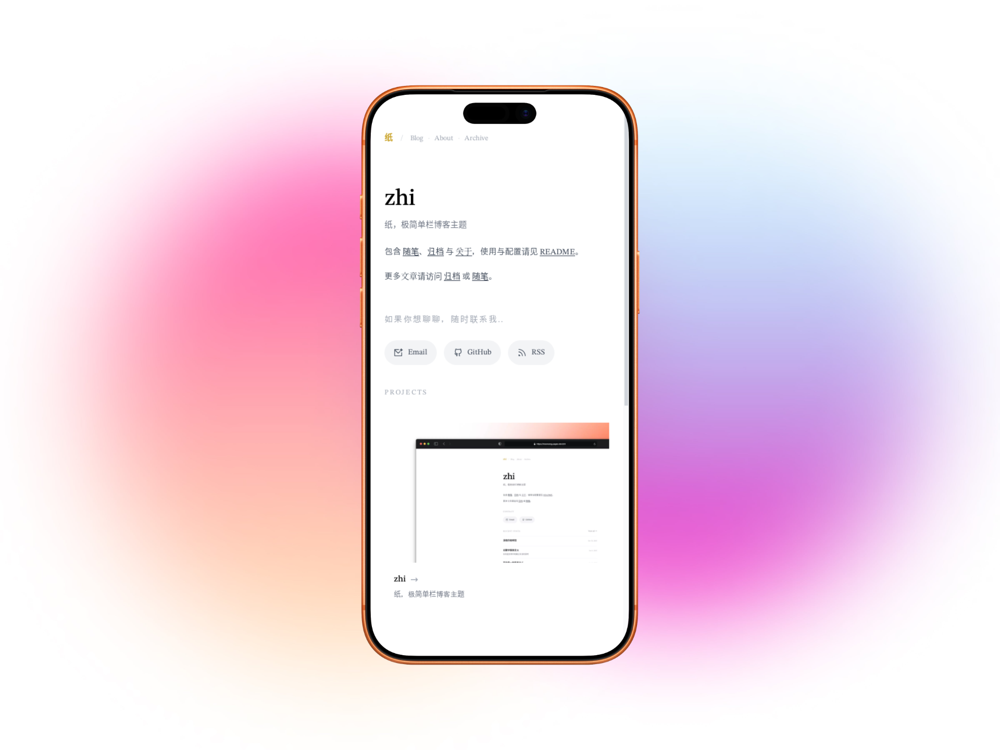
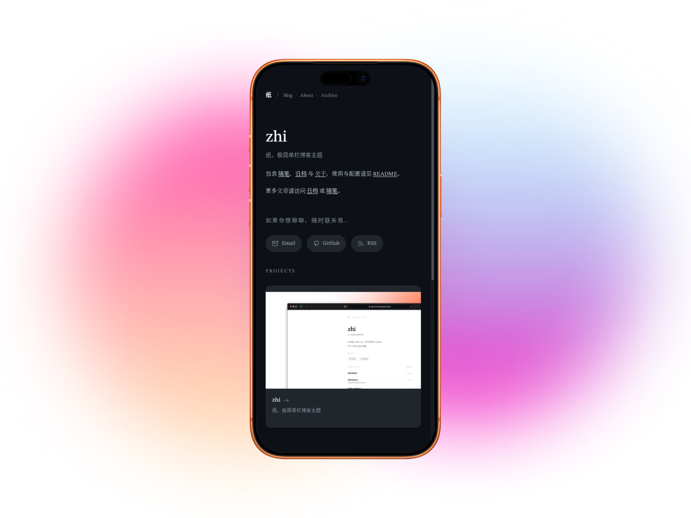
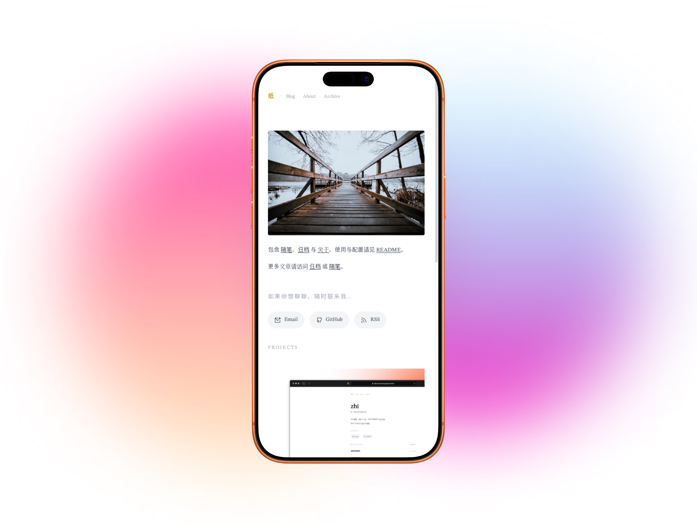
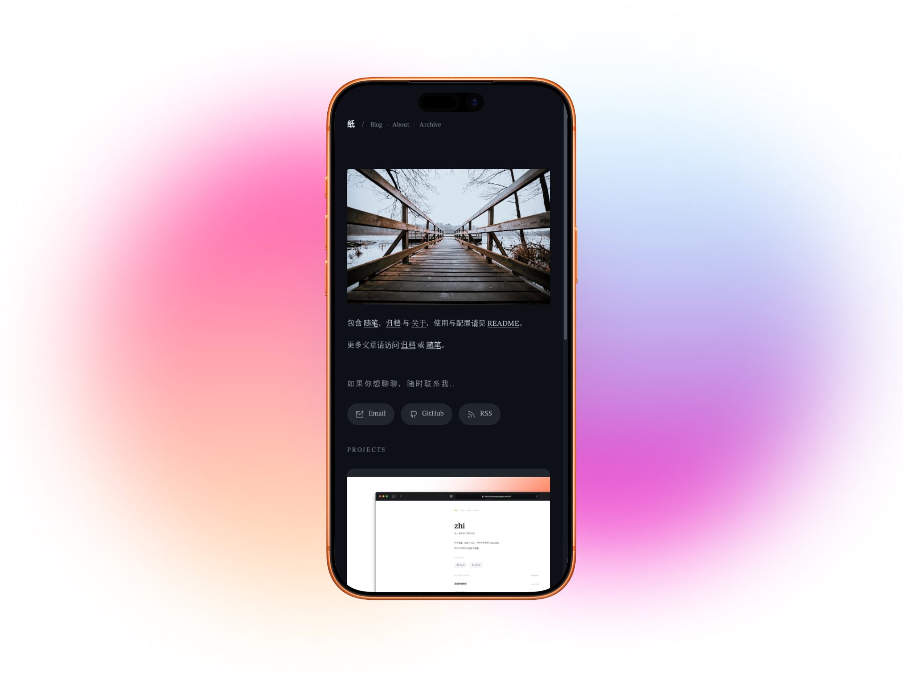

# zhi

[](https://vercel.com/new/clone?repository-url=https://github.com/imWang121/astro-zhi) [](https://app.netlify.com/start/deploy?repository=https://github.com/imWang121/astro-zhi) [](https://dash.cloudflare.com/?to=/:account/workers-and-pages)
[](https://docs.astro.build/) [](LICENSE)

纸，一个极简单栏博客主题，专注内容本身。

## 预览

<p align="center">
  
</p>

### PC 端

<p align="center">
  
  
</p>

<p align="center">
  
  
</p>

### 移动端

<p align="center">
  
  
  
  
</p>

## 特性

- 极简单栏布局，专注阅读体验
- 暗/亮色模式切换
- 首页介绍支持文字/图片两种模式
- Markdown/MDX 支持
- 代码高亮（Prism）
- 图片灯箱
- 多图排版
- Callout 提示框（note/tip/info/warning）
- Pullquote 引用样式
- RSS 订阅
- Gzip 压缩
- 响应式设计

## 快速开始

### 环境要求

- Node.js 18+

### 安装

```bash
# 克隆仓库
git clone https://github.com/imWang121/astro-zhi.git
cd astro-zhi

# 安装依赖
npm install

# 启动开发服务器
npm run dev
```

### 命令

| 命令 | 说明 |
|------|------|
| `npm run dev` | 启动开发服务器 |
| `npm run build` | 构建生产版本 |
| `npm run preview` | 预览构建结果 |

## 配置

### 站点信息

编辑 `src/consts.ts`：

```ts
export const SITE_TITLE = 'zhi';
export const SITE_DESCRIPTION = '纸，极简单栏博客主题';
export const GITHUB_REPO = 'https://github.com/imWang121/astro-zhi';
export const SITE_START_YEAR = 2025;
export const SHOW_START_YEAR = true;
```

### 首页配置

```ts
export const HOME_SECTIONS = {
  intro: true,
  about: true,
  contact: true,
  projects: false,
  recentPosts: true,
  recentPostsCount: 5,
};
```

### 个人介绍配置

支持两种模式：文字介绍或图片展示

```ts
// 选择模式：'text' 或 'image'
export const INTRO_MODE = 'text';

// 文字模式配置
export const INTRO = {
  greeting: '',
  name: 'zhi',
  tagline: '纸，极简单栏博客主题',
};

// 图片模式配置（适合展示你想说的并配图）
export const INTRO_IMAGE = {
  src: '/images/intro-quote.webp',
  alt: '图片',
  caption: '',
};
```

## 内容

### 创建文章

在 `src/content/blog/` 目录下创建 `.md` 或 `.mdx` 文件：

```md
---
title: 文章标题
description: 文章描述
date: 2025-01-01
heroImage: /images/cover.webp
tags:
  - 标签1
  - 标签2
---

文章内容...
```

### Frontmatter 字段

| 字段 | 必填 | 说明 |
|------|------|------|
| `title` | 是 | 文章标题 |
| `description` | 否 | 文章描述（SEO） |
| `date` | 是 | 发布日期 |
| `updatedDate` | 否 | 更新日期 |
| `heroImage` | 否 | 封面图片 |
| `draft` | 否 | 草稿（true 隐藏） |
| `archive` | 否 | 归档显示（false 隐藏） |
| `abbrlink` | 否 | 自定义 URL |
| `badge` | 否 | 列表徽标 |
| `tags` | 否 | 标签数组 |

### Markdown 扩展

#### Callout 提示框

```md
:::note
无标题提示框
:::

:::tip[标题]
有标题提示框
:::
```

支持类型：`note`、`tip`、`info`、`warning`

#### Pullquote

```md
> 这是一段重要观点。
> 
> — 作者名
```

#### 多图排版

```md
:::gallery


:::
```

## 部署

### 一键部署

[](https://vercel.com/new/clone?repository-url=https://github.com/imWang121/astro-zhi) [](https://app.netlify.com/start/deploy?repository=https://github.com/imWang121/astro-zhi) [](https://dash.cloudflare.com/?to=/:account/workers-and-pages)

### GitHub Pages

1. Fork 本仓库
2. 在 Settings > Pages 选择 GitHub Actions
3. 推送代码自动部署

### 环境变量

| 变量 | 说明 |
|------|------|
| `SITE_URL` | 站点完整 URL（如 `https://example.com`） |

## 项目结构

```
astro-zhi/
├── public/              # 静态资源
├── src/
│   ├── components/      # 组件
│   ├── content/         # 内容集合
│   │   └── blog/        # 博客文章
│   ├── layouts/         # 布局模板
│   ├── pages/           # 页面路由
│   ├── plugins/         # 自定义插件
│   ├── styles/          # 样式文件
│   └── consts.ts        # 全局配置
├── astro.config.mjs     # Astro 配置
└── package.json
```

## 技术栈

- [Astro](https://astro.build/) - 静态站点生成器
- [TypeScript](https://www.typescriptlang.org/) - 类型安全
- [Markdown/MDX](https://mdxjs.com/) - 内容写作
- [Prism](https://prismjs.com/) - 代码高亮
- [Sharp](https://sharp.pixelplumbing.com/) - 图片优化

## 字体

项目使用了精心挑选的字体组合，以提供最佳的阅读体验：

| 字体 | 用途 |
|------|------|
| EarlySummer | 优雅的衬线字体，用于标题和强调文本 |
| STIX | 学术级衬线字体，用于正文和数学符号 |
| NotoSansSC | 思源黑体，用于中文文本显示 |
| Snell | 手写风格衬线字体，用于特殊装饰 |

字体配置参考了 [astro-theme-retypeset](https://github.com/richard-stokes/astro-theme-retypeset) 项目，感谢其提供的优秀字体方案。

## 参考项目

本项目的想法功能、页面设计风格和字体配置参考了以下开源项目：

| 项目 | 说明 |
|------|------|
| [astro-chiri](https://github.com/nicknisi/astro-chiri) | 一个极简的 Astro 博客主题，提供了优雅的页面设计风格 |
| [astro-theme-retypeset](https://github.com/richard-stokes/astro-theme-retypeset) | 提供了优秀的字体配置方案 |
| [astro-whono](https://github.com/cxro/astro-whono) | 部分演示文章和功能灵感来源 |

感谢这些优秀的开源项目，它们为这个网站的设计和实现提供了灵感和参考。

## 许可证

## License

This project is licensed under the MIT License - see the LICENSE file for details. [MIT](LICENSE)
